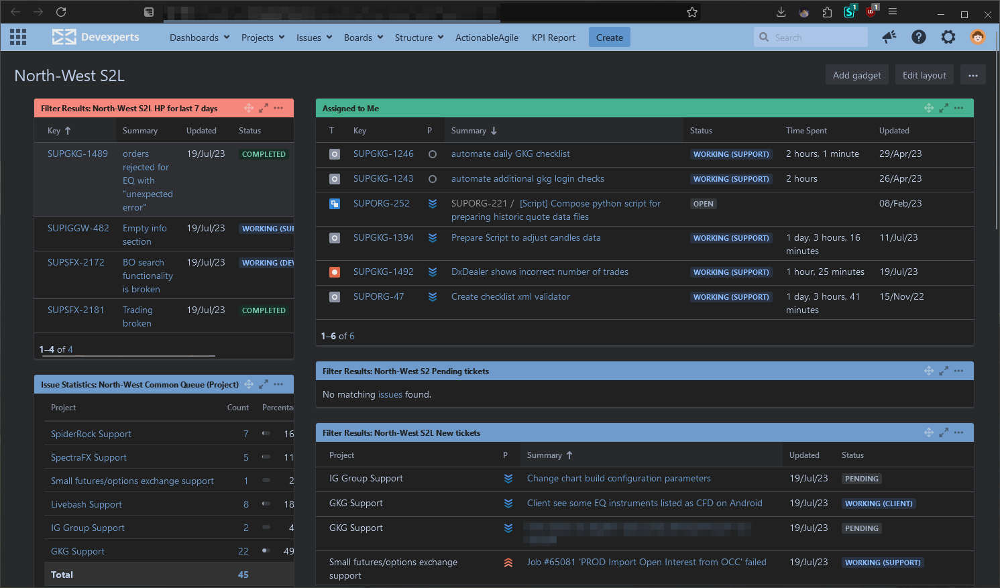
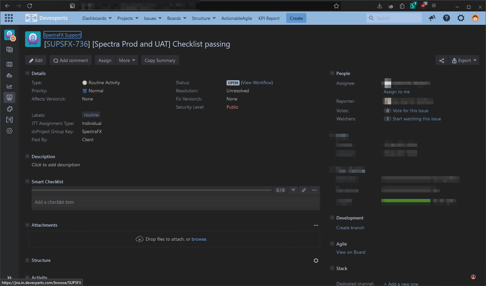
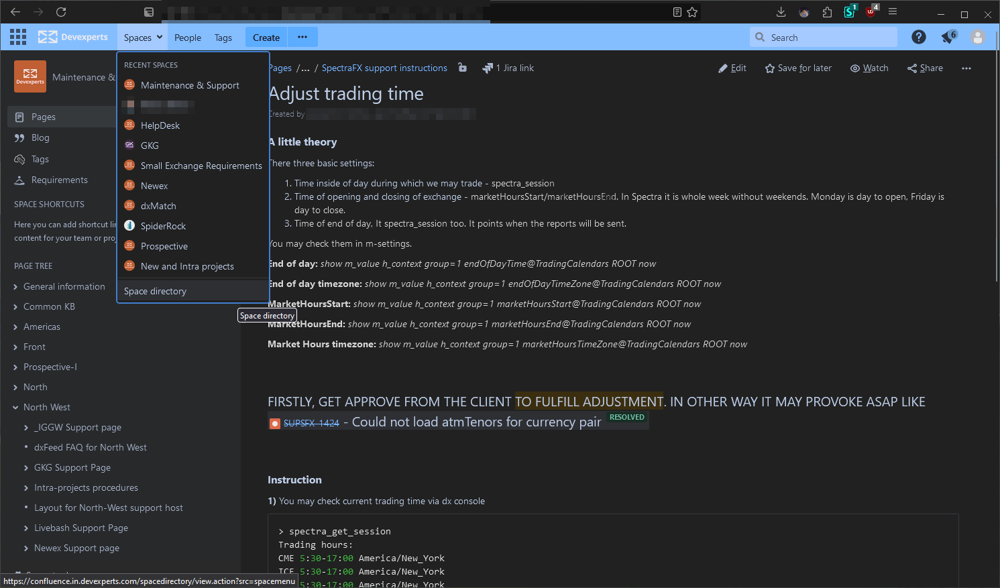
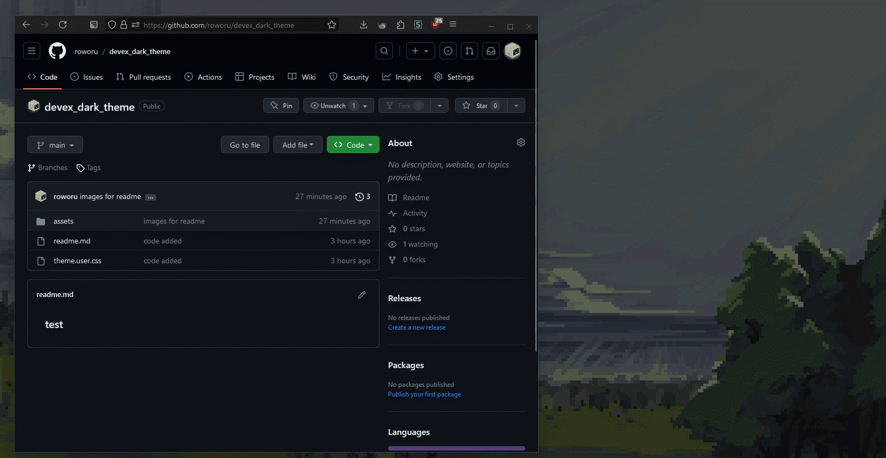
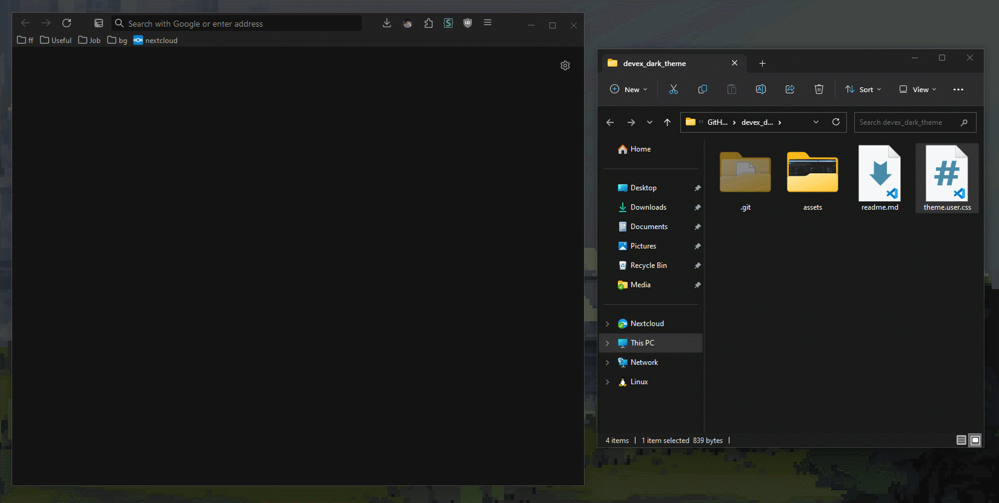

## Expected results:

 </n>
 </n>

## To do so:

### 1) Install Stylus extension for your browser
It is free and OSS extension, that allows us apply custom themes for any website.
Go grab it for you favourite browser: </n>
#### Chrome
https://chrome.google.com/webstore/detail/stylus/clngdbkpkpeebahjckkjfobafhncgmne

#### Firefox
https://addons.mozilla.org/en-US/firefox/addon/styl-us/

### 2) Download a theme.user.css file from this repo

### 3) Open theme.user.css file with your browser
Or just drag it like that...: </n>

### 4) Done!